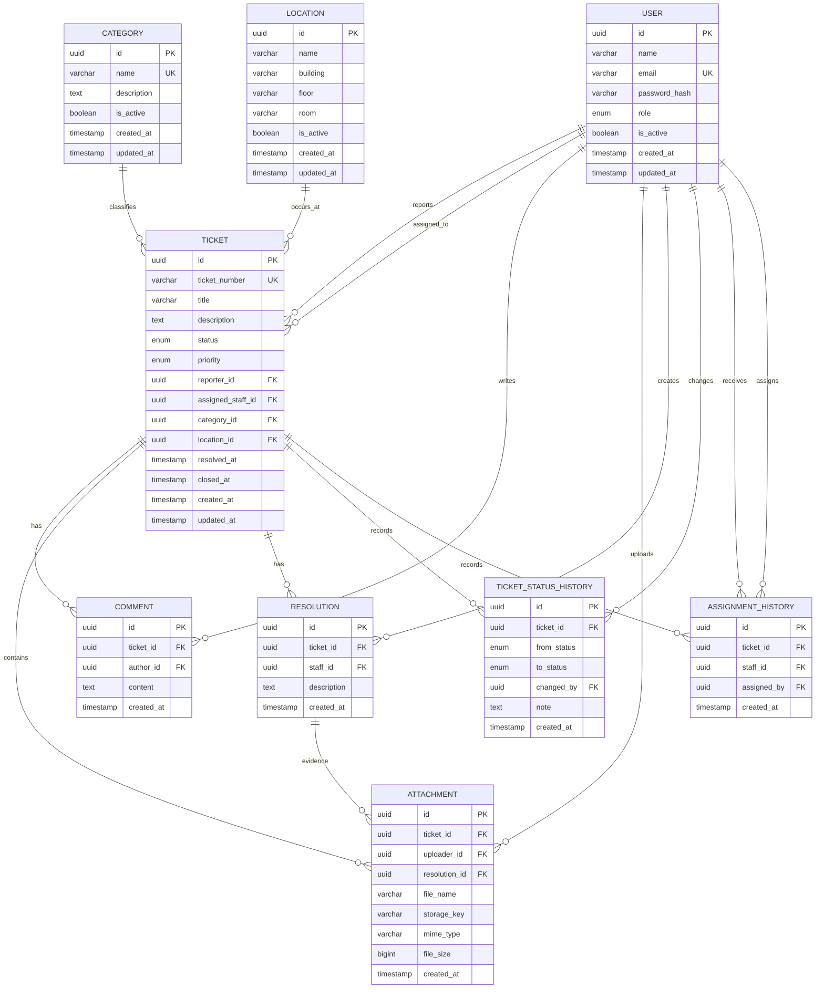

# Campus Service Desk — ERD & Relational Schema

## 1. Purpose

This document defines the relational database design for Campus Service Desk.

The design is derived from the requirements and domain model.

The initial database will use PostgreSQL.

Prisma will later implement this relational design.

---

# 2. Database Tables

The MVP consists of the following main tables:

```text
users
categories
locations
tickets
comments
attachments
resolutions
ticket_status_history
assignment_history
```

---

# 3. Entity Relationship Overview

```text
users
  │
  ├──────────────┐
  │              │
  │              ├───────────────┐
  │              │               │
  ▼              ▼               ▼
tickets       comments       attachments
  │
  ├──────────────→ categories
  │
  ├──────────────→ locations
  │
  ├──────────────→ users (assigned staff)
  │
  ├──────────────→ resolutions
  │
  ├──────────────→ ticket_status_history
  │
  └──────────────→ assignment_history
```

---

# 4. Users Table

## Table

`users`

## Purpose

Stores application users.

## Columns

| Column        | Type      | Null                   | Constraints             |
| ------------- | --------- | ---------------------- | ----------------------- |
| id            | UUID      | No                     | Primary Key             |
| name          | VARCHAR   | No                     |                         |
| email         | VARCHAR   | No                     | Unique                  |
| password_hash | VARCHAR   | Depends on auth design |                         |
| role          | ENUM      | No                     | STUDENT / STAFF / ADMIN |
| is_active     | BOOLEAN   | No                     | Default true            |
| created_at    | TIMESTAMP | No                     |                         |
| updated_at    | TIMESTAMP | No                     |                         |

### Notes

`password_hash` represents an authentication credential stored by the application if we use application-managed password authentication.

If the selected authentication provider manages credentials externally, this field may not be required.

That decision will be finalized during authentication architecture.

---

# 5. Categories Table

## Table

`categories`

## Columns

| Column      | Type      | Null | Constraints  |
| ----------- | --------- | ---- | ------------ |
| id          | UUID      | No   | Primary Key  |
| name        | VARCHAR   | No   | Unique       |
| description | TEXT      | Yes  |              |
| is_active   | BOOLEAN   | No   | Default true |
| created_at  | TIMESTAMP | No   |              |
| updated_at  | TIMESTAMP | No   |              |

### Rules

* Category name must be unique.
* Deactivation is preferred over destructive deletion when historical tickets reference the category.

---

# 6. Locations Table

## Table

`locations`

## Columns

| Column     | Type      | Null | Constraints  |
| ---------- | --------- | ---- | ------------ |
| id         | UUID      | No   | Primary Key  |
| name       | VARCHAR   | No   |              |
| building   | VARCHAR   | Yes  |              |
| floor      | VARCHAR   | Yes  |              |
| room       | VARCHAR   | Yes  |              |
| is_active  | BOOLEAN   | No   | Default true |
| created_at | TIMESTAMP | No   |              |
| updated_at | TIMESTAMP | No   |              |

### Notes

The MVP intentionally keeps location structure simple.

We do not create separate tables for:

```text
buildings
floors
rooms
```

unless future real-world requirements justify that normalization.

---

# 7. Tickets Table

## Table

`tickets`

This is the central business table.

## Columns

| Column            | Type      | Null | Constraints        |
| ----------------- | --------- | ---- | ------------------ |
| id                | UUID      | No   | Primary Key        |
| ticket_number     | VARCHAR   | No   | Unique             |
| title             | VARCHAR   | No   |                    |
| description       | TEXT      | No   |                    |
| status            | ENUM      | No   | Default OPEN       |
| priority          | ENUM      | No   | Default MEDIUM     |
| reporter_id       | UUID      | No   | FK → users.id      |
| assigned_staff_id | UUID      | Yes  | FK → users.id      |
| category_id       | UUID      | No   | FK → categories.id |
| location_id       | UUID      | No   | FK → locations.id  |
| resolved_at       | TIMESTAMP | Yes  |                    |
| closed_at         | TIMESTAMP | Yes  |                    |
| created_at        | TIMESTAMP | No   |                    |
| updated_at        | TIMESTAMP | No   |                    |

---

# 8. Ticket Status

The database value set is:

```text
OPEN
ASSIGNED
IN_PROGRESS
RESOLVED
CLOSED
CANCELLED
```

The database may represent this as a PostgreSQL enum through Prisma.

The application layer must still enforce valid transitions.

The database value alone is not enough to guarantee workflow correctness.

---

# 9. Ticket Priority

The database value set is:

```text
LOW
MEDIUM
HIGH
URGENT
```

New tickets default to:

```text
MEDIUM
```

Students do not directly control the official priority.

---

# 10. Comments Table

## Table

`comments`

## Columns

| Column     | Type      | Null | Constraints     |
| ---------- | --------- | ---- | --------------- |
| id         | UUID      | No   | Primary Key     |
| ticket_id  | UUID      | No   | FK → tickets.id |
| author_id  | UUID      | No   | FK → users.id   |
| content    | TEXT      | No   |                 |
| created_at | TIMESTAMP | No   |                 |

## Relationships

```text
Ticket 1 ─── N Comment
User   1 ─── N Comment
```

---

# 11. Attachments Table

## Table

`attachments`

## Columns

| Column        | Type             | Null | Constraints         |
| ------------- | ---------------- | ---- | ------------------- |
| id            | UUID             | No   | Primary Key         |
| ticket_id     | UUID             | No   | FK → tickets.id     |
| uploader_id   | UUID             | No   | FK → users.id       |
| resolution_id | UUID             | Yes  | FK → resolutions.id |
| file_name     | VARCHAR          | No   |                     |
| storage_key   | VARCHAR          | No   |                     |
| mime_type     | VARCHAR          | No   |                     |
| file_size     | INTEGER / BIGINT | No   |                     |
| created_at    | TIMESTAMP        | No   |                     |

## Important design decision

`resolution_id` is nullable.

Therefore an attachment can belong to:

```text
Ticket only
```

or:

```text
Ticket + specific Resolution
```

Example:

Student uploads:

```text
broken-projector.jpg
```

This is associated with the ticket.

Later staff uploads:

```text
replaced-projector.jpg
```

This can be associated with the specific resolution attempt.

This lets us keep the attachment model flexible without creating a separate "ResolutionAttachment" table.

---

# 12. Resolutions Table

## Table

`resolutions`

## Columns

| Column      | Type      | Null | Constraints     |
| ----------- | --------- | ---- | --------------- |
| id          | UUID      | No   | Primary Key     |
| ticket_id   | UUID      | No   | FK → tickets.id |
| staff_id    | UUID      | No   | FK → users.id   |
| description | TEXT      | No   |                 |
| created_at  | TIMESTAMP | No   |                 |

## Relationship

```text
Ticket 1 ─── N Resolution
User   1 ─── N Resolution
```

A ticket may have multiple resolution attempts.

---

# 13. Ticket Status History Table

## Table

`ticket_status_history`

## Columns

| Column      | Type      | Null | Constraints     |
| ----------- | --------- | ---- | --------------- |
| id          | UUID      | No   | Primary Key     |
| ticket_id   | UUID      | No   | FK → tickets.id |
| from_status | ENUM      | Yes  |                 |
| to_status   | ENUM      | No   |                 |
| changed_by  | UUID      | No   | FK → users.id   |
| note        | TEXT      | Yes  |                 |
| created_at  | TIMESTAMP | No   |                 |

### Initial status

For the initial `OPEN` record:

```text
from_status = NULL
to_status   = OPEN
```

This allows the history to represent ticket creation as the first lifecycle event.

---

# 14. Assignment History Table

## Table

`assignment_history`

## Columns

| Column      | Type      | Null | Constraints     |
| ----------- | --------- | ---- | --------------- |
| id          | UUID      | No   | Primary Key     |
| ticket_id   | UUID      | No   | FK → tickets.id |
| staff_id    | UUID      | No   | FK → users.id   |
| assigned_by | UUID      | No   | FK → users.id   |
| created_at  | TIMESTAMP | No   |                 |

### Meaning

`staff_id` identifies the person receiving responsibility.

`assigned_by` identifies the administrator who performed the assignment.

---

# 15. Relationships

## User → Ticket (Reporter)

```text
User 1 ─── N Ticket
```

A student can create many tickets.

Each ticket has exactly one reporter.

Foreign key:

```text
tickets.reporter_id → users.id
```

---

## User → Ticket (Current Assignee)

```text
User 1 ─── N Ticket
```

A staff member can currently have many assigned tickets.

A ticket may have zero or one current assignee.

Foreign key:

```text
tickets.assigned_staff_id → users.id
```

This relationship is nullable because an `OPEN` ticket may not yet be assigned.

---

## Category → Ticket

```text
Category 1 ─── N Ticket
```

Every ticket belongs to one category.

---

## Location → Ticket

```text
Location 1 ─── N Ticket
```

Every ticket belongs to one location.

---

## Ticket → Comment

```text
Ticket 1 ─── N Comment
```

A ticket can have zero or many comments.

---

## User → Comment

```text
User 1 ─── N Comment
```

Each comment has exactly one author.

---

## Ticket → Attachment

```text
Ticket 1 ─── N Attachment
```

A ticket can have zero or many attachments.

---

## User → Attachment

```text
User 1 ─── N Attachment
```

Each attachment has one uploader.

---

## Ticket → Resolution

```text
Ticket 1 ─── N Resolution
```

A ticket may have zero or many resolution attempts.

---

## User → Resolution

```text
User 1 ─── N Resolution
```

Each resolution is created by one staff member.

---

## Ticket → Status History

```text
Ticket 1 ─── N TicketStatusHistory
```

Every ticket can have multiple status-history events.

---

## User → Status History

```text
User 1 ─── N TicketStatusHistory
```

The user who caused the status change is recorded.

---

## Ticket → Assignment History

```text
Ticket 1 ─── N AssignmentHistory
```

A ticket can have multiple assignment events.

---

## User → Assignment History

Each assignment history record references:

```text
staff_id
assigned_by
```

This allows us to distinguish:

```text
Who received the assignment?
```

from:

```text
Who made the assignment?
```

---

# 16. Foreign Key Delete Behavior

The database must protect historical integrity.

## Users

A user should not normally be physically deleted when they are referenced by historical records.

Preferred behavior:

```text
users.is_active = false
```

rather than deleting the user.

---

## Categories

If a category is used by existing tickets:

```text
deactivate
```

rather than destructive deletion.

---

## Locations

If a location is used by existing tickets:

```text
deactivate
```

rather than destructive deletion.

---

## Tickets

Deleting a ticket should not be a normal MVP operation.

Tickets represent operational history.

Future archival behavior should be considered separately.

---

# 17. Unique Constraints

The MVP requires:

```text
users.email
categories.name
tickets.ticket_number
```

to be unique.

Additional uniqueness constraints may be introduced where justified.

---

# 18. Recommended Indexes

Indexes should support common access patterns.

Recommended initial indexes:

### Tickets

```text
tickets.reporter_id
tickets.assigned_staff_id
tickets.status
tickets.priority
tickets.category_id
tickets.location_id
tickets.created_at
```

### Comments

```text
comments.ticket_id
comments.created_at
```

### Attachments

```text
attachments.ticket_id
attachments.resolution_id
```

### Resolutions

```text
resolutions.ticket_id
resolutions.created_at
```

### Status history

```text
ticket_status_history.ticket_id
ticket_status_history.created_at
```

### Assignment history

```text
assignment_history.ticket_id
assignment_history.created_at
```

Indexes will be reviewed against actual query patterns rather than added blindly.

---

# 19. Referential Integrity

Foreign keys must prevent records from referencing non-existent entities.

Examples:

```text
ticket.reporter_id
```

must reference an existing user.

```text
ticket.category_id
```

must reference an existing category.

```text
comment.ticket_id
```

must reference an existing ticket.

---

# 20. ERD — Mermaid

The following diagram represents the MVP relational model.



---

# 21. Important Database Design Decisions

## Decision 1 — UUID primary keys

MVP tables will use UUID primary keys.

Reasons:

* IDs are difficult to guess.
* They work well across distributed/application environments.
* They avoid exposing simple sequential database IDs as resource identifiers.

The human-readable ticket number remains separate.

---

## Decision 2 — Ticket number is separate from primary key

The ticket may internally have:

```text
id = UUID
```

while the user sees:

```text
CSD-2026-000124
```

This separates database identity from human-facing identification.

---

## Decision 3 — Current and historical assignment are separate

`tickets.assigned_staff_id`

answers:

> Who is assigned now?

`assignment_history`

answers:

> Who has been assigned before, and who assigned them?

---

## Decision 4 — Current and historical status are separate

`tickets.status`

answers:

> What is the status now?

`ticket_status_history`

answers:

> What happened to the ticket over time?

---

## Decision 5 — Resolution attempts are historical records

A ticket may have multiple resolutions.

This supports the requirement that a rejected resolution must be preserved.

---

## Decision 6 — Soft deactivation for reference data

Categories, locations, and users are not normally physically deleted when historical references exist.

---

## Decision 7 — No generic audit table yet

The MVP uses focused history tables for:

* Status
* Assignment

A generic `audit_logs` table remains a future extension.

---

# 22. Database Integrity Goals

The final schema should ensure:

```text
No orphaned comments
No orphaned attachments
No orphaned resolutions
No invalid foreign-key references
No duplicate email addresses
No duplicate ticket numbers
No references to deleted historical data
```

Application logic will additionally enforce:

```text
Valid status transitions
Role permissions
Ownership rules
Assignment rules
Resolution rules
Cancellation rules
```

The database and application therefore have complementary responsibilities.

---

# 23. Database Responsibility vs Application Responsibility

## Database should protect

* Primary keys
* Foreign keys
* Unique values
* Required values
* Basic data types
* Referential integrity

## Application should protect

* User permissions
* Resource ownership
* Status transition rules
* Business workflows
* Role-specific actions
* File validation
* User-facing validation

Neither layer should be expected to do everything.

---

# 24. Deferred Database Decisions

The following remain intentionally open until the technology/authentication phase:

* Exact authentication provider model
* Password storage implementation
* Ticket number generation mechanism
* Exact timestamp type/time-zone strategy
* Attachment storage provider
* Whether database enums or lookup tables are preferred for controlled values
* Production database hosting provider

These decisions do not invalidate the relational domain model.

---

## Status

System Design — ERD and relational schema defined.

Next step: Technology and architecture decisions before Prisma implementation.
